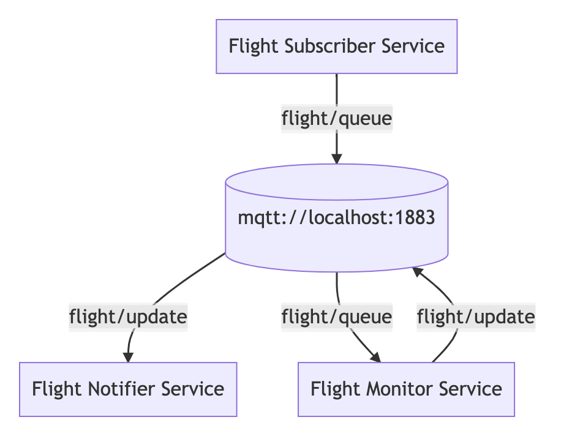

<h5 align="center">
  <br>
  <a href="https://www.asyncapi.org"></a>
  <br>
  Applications Relation Finder
</h5>

 

<!-- toc is generated with GitHub Actions do not remove toc markers -->

<!-- toc -->

- [Overview](#overview)
- [Install](#install)
  - [Technical Details](#technical-details)
- [API Documentation](#api-documentation)
- [Usage](#usage)
  - [Node.js](#nodejs)
  - [Default Output Syntax](#default-output-syntax)
- [Mermaid Flowchart](#mermaid-flowchart)
  - [Syntax](#syntax)
  - [Flowchart](#flowchart)
- [PlantUML classDiagram](#plantuml-classdiagram)
  - [Syntax](#syntax-1)
  - [ClassDiagram](#classdiagram)
- [React Flow  Nodes](#react-flow--nodes)
  - [Syntax](#syntax-2)
  - [React Flow Nodes](#react-flow-nodes)
  - [Steps to visualize relations in React Flow](#steps-to-visualize-relations-in-react-flow)
- [Develop](#develop)
- [Contributing](#contributing)

<!-- tocstop -->

## Overview
An official library that focuses on finding and analyzing the relationships between AsyncAPI files to later output consolidated information about the system architecture. Output format would be customizable and available in different formats like PlantUML, mermaid.js, ReactFlow.
## Install

```
npm install @asyncapi/app-relations-discovery
```

### Technical Details
This library takes AsyncAPI files as an array input for which the user wants to discover the relations between them. It then validates and parses the given array of AsyncAPI files and generates the output in desired passed syntax.
In the process, for every different server it assigns a slug having server's URL and protocol and then maps channels with the same server. Following, it maps the service information with the channel's name as per if the service is subscribing/publishing to a given channel. In the sub/pub Map of default output syntax, it provides service name and the metadata of the service including but not limited to `description`, `payload`, `headers`, `bindings`, `extensions`.
## API Documentation

See [API documentation](https://github.com/asyncapi/app-relations-discovery/blob/master/API.md) for more example and full API reference information.


## Usage

### Node.js

```javascript
const appRelationsDiscovery = require('@asyncapi/app-relations-discovery');
const path = require('path');
const fs = require('fs');

const examplesPath = './test/examples/flightService';

function getAsyncApiExamples() {
  const docs = [];
  const files = fs.readdirSync(examplesPath);
  for (const file of files) {
    const document_path = path.join('./examples/flightService', file);
    const asyncApiDoc = fs.readFileSync(path.resolve(__dirname, document_path),'utf8');
    docs.push(asyncApiDoc);
  }
  return docs;
}

// For default output syntax
const defaultOutput = appRelationsDiscovery.getRelations(...docs);

// For mermaid Flowchart 
const mermaidFlowchart = appRelationsDiscovery.getRelations(...docs,{syntax:'mermaid'});

// For plantUML classDiagram 
const plantUMLClassDiagram = appRelationsDiscovery.getRelations(...docs,{syntax:'plantUML'});

// For reactFlow nodes
const reactFlowNodes = appRelationsDiscovery.getRelations(...docs,{syntax:'reactFlow'});
```

### Default Output Syntax

// Explain:

```javascript
Map(n) {
  '<server1>' => Map(m) {
    'channel1' => { sub: [Map(1) {"<Service Name>" => "<metadata>"}, ...], pub: [[Map(1) {"<Service Name>" => "<metadata>"}, ...] },
    'channel2' => { sub: [[Map(1) {"<Service Name>" => "<metadata>"}, ...], pub: [[Map(1) {"<Service Name>" => "<metadata>"}, ...] }
  }
}
```
## Mermaid Flowchart
### Syntax
Based on FlightService example.
```
graph TD
 server1[(mqtt://localhost:1883)]
FlightMonitorService[Flight Monitor Service]
FlightMonitorService -- flight/update --> server1
FlightNotifierService[Flight Notifier Service]
server1 -- flight/update --> FlightNotifierService
FlightSubscriberService[Flight Subscriber Service]
FlightSubscriberService -- flight/queue --> server1
server1 -- flight/queue --> FlightMonitorService
```

### Flowchart

 </br></br>

**[Code snippet with syntax](https://mermaid-js.github.io/mermaid-live-editor/edit#eyJjb2RlIjoiZ3JhcGggVERcbiBzZXJ2ZXIxWyhtcXR0Oi8vbG9jYWxob3N0OjE4ODMpXVxuRmxpZ2h0TW9uaXRvclNlcnZpY2VbRmxpZ2h0IE1vbml0b3IgU2VydmljZV1cbkZsaWdodE1vbml0b3JTZXJ2aWNlIC0tIGZsaWdodC91cGRhdGUgLS0-IHNlcnZlcjFcbkZsaWdodE5vdGlmaWVyU2VydmljZVtGbGlnaHQgTm90aWZpZXIgU2VydmljZV1cbnNlcnZlcjEgLS0gZmxpZ2h0L3VwZGF0ZSAtLT4gRmxpZ2h0Tm90aWZpZXJTZXJ2aWNlXG5GbGlnaHRTdWJzY3JpYmVyU2VydmljZVtGbGlnaHQgU3Vic2NyaWJlciBTZXJ2aWNlXVxuRmxpZ2h0U3Vic2NyaWJlclNlcnZpY2UgLS0gZmxpZ2h0L3F1ZXVlIC0tPiBzZXJ2ZXIxXG5zZXJ2ZXIxIC0tIGZsaWdodC9xdWV1ZSAtLT4gRmxpZ2h0TW9uaXRvclNlcnZpY2UiLCJtZXJtYWlkIjoie1xuICBcInRoZW1lXCI6IFwiZGVmYXVsdFwiXG59IiwidXBkYXRlRWRpdG9yIjp0cnVlLCJhdXRvU3luYyI6dHJ1ZSwidXBkYXRlRGlhZ3JhbSI6dHJ1ZX0)**
## PlantUML classDiagram 

### Syntax
Based on FlightService example.
```
@startuml
title Classes - Class Diagram

class server1 { 
 url: mqtt://localhost:1883 
 protocol: mqtt
}
FlightMonitorService --|> server1:flight/update
server1 --|> FlightNotifierService:flight/update
FlightSubscriberService --|> server1:flight/queue
server1 --|> FlightMonitorService:flight/queue
@enduml
```
### ClassDiagram

 </br></br>

**[Code snippet with syntax](https://www.planttext.com/?text=VP3D3e8m3CVlVOgz02742zd1a6YywOKd6AF0aa6Xwxoexou1EM2CjpRz_JzIA88ObjXx42SUrScR432eP9tKsPcMJGzWbpKWtv4pzL2W8dkj-ab4fwadQtn7GNIMvuVvE389MVeGy8ABTsqdLngS49UpZREeakHvt3nrin1f76iZ25lIWgpY6ubh76xgBy7AbB4Abbs5VpEcYF5dnBxV7YzmgET7lG40)**
## React Flow  Nodes 

### Syntax
Based on FlightService example.
```javascript
[
  {
    id: 'Server1',
    data: { label: 'mqtt://localhost:1883,mqtt' },
    position: { x: 250, y: 5 }
  },
  {
    id: 'FlightMonitorService',
    data: { label: 'Flight Monitor Service' },
    position: { x: 100, y: 10 }
  },
  {
    id: 'edge1',
    source: 'FlightMonitorService',
    target: 'Server1',
    animated: true,
    label: 'flight/update',
    type: 'edgeType',
    arrowHeadType: 'arrowclosed'
  },
  {
    id: 'FlightNotifierService',
    data: { label: 'Flight Notifier Service' },
    position: { x: 100, y: 10 }
  },
  {
    id: 'edge2',
    source: 'Server1',
    target: 'FlightNotifierService',
    animated: true,
    label: 'flight/update',
    type: 'edgeType',
    arrowHeadType: 'arrowclosed'
  },
  {
    id: 'FlightSubscriberService',
    data: { label: 'Flight Subscriber Service' },
    position: { x: 100, y: 10 }
  },
  {
    id: 'edge3',
    source: 'FlightSubscriberService',
    target: 'Server1',
    animated: true,
    label: 'flight/queue',
    type: 'edgeType',
    arrowHeadType: 'arrowclosed'
  },
  {
    id: 'edge4',
    source: 'Server1',
    target: 'FlightMonitorService',
    animated: true,
    label: 'flight/queue',
    type: 'edgeType',
    arrowHeadType: 'arrowclosed'
  }
]
```
### React Flow Nodes

 </br></br>

### Steps to visualize relations in React Flow 

1. Setup a react project in which you want to display reactFlow nodes.
2. Install `@asyncapi/app-relations-discovery` into the project.
3. Make a react component for the example.

**Example**
```javascript
import React from 'react';
import ReactFlow from 'react-flow-renderer';
import appRelationsDiscovery from '@asyncapi/app-relations-discovery';

const elements = appRelationsDiscovery.getRelations(...docs,{syntax:'reactFlow'});

export default () => (
  <div style={{ height: 300 }}>
    <ReactFlow elements={elements} />
  </div>
);
```

## Develop

1. Clone the project `git clone https://github.com/asyncapi/app-relations-discovery.git`
2. Install the dependencies `npm i`
3. For a quick overview you can run tests by `npm test`. You can also contribute to provide more different syntax outputs to visualize the relations.
4. Write code and tests.
5. Make sure all tests pass `npm test`
6. Make sure code is well formatted and secure `npm run lint`


## Contributing

Read [CONTRIBUTING](https://github.com/asyncapi/.github/blob/master/CONTRIBUTING.md) guide.